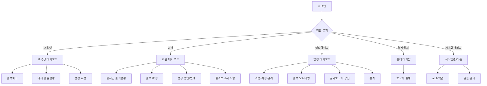

# 소방학교 출석체크 시스템 — 사이트맵 & 기능정의서

> 이 문서는 [[소방학교 출석체크 시스템 기획 방향]]에서 정의한 역할(교육생/교관/행정담당자/결재권자/시스템관리자)과 검토사항(출결상태, 인증방식, 정정, 오프라인 대응 등)을 화면 단위로 구체화한 것입니다.

## 0. 사용자 역할 요약

| 역할 코드 | 역할명 | 설명 |
|---|---|---|
| STU | 교육생 | 출석체크 수행, 본인 출결 조회 |
| INS | 담당 교관 | 과정별 출석 확정, 정정 승인, 결과보고서 작성 |
| ADM | 행정담당자 | 과정/계정/장비 마스터 관리, 통계, 보고서 상신 |
| APR | 결재권자(학교장 등) | 결과보고서 결재 |
| SYS | 시스템관리자 | 시스템 전반 관리, 로그/백업/설정 |

---

## 1. 전체 사이트맵 (트리 구조)

```
소방학교 출석관리시스템
├─ 00. 공통
│  ├─ 로그인 (/login)
│  ├─ 비밀번호 찾기/초기화 (/login/reset)
│  ├─ 마이페이지 (/mypage)
│  ├─ 공지사항 목록/상세 (/notice, /notice/:id)
│  ├─ 도움말/매뉴얼 (/help)
│  ├─ 시스템 점검 안내 (/maintenance)
│  └─ 접근권한 없음/오류 페이지 (/403, /404, /500)
│
├─ 10. 교육생 (STU)
│  ├─ 대시보드 (/student)
│  ├─ 출석체크 (/student/attendance/check)
│  ├─ 나의 출결현황 (/student/attendance/history)
│  ├─ 출결 정정 요청 (/student/attendance/correction)
│  ├─ 나의 과정 정보 (/student/course)
│  └─ 알림함 (/student/alerts)
│
├─ 20. 담당 교관 (INS)
│  ├─ 대시보드 (/instructor)
│  ├─ 과정 선택 (/instructor/courses)
│  ├─ 실시간 출석현황 (/instructor/courses/:id/attendance)
│  ├─ 출석 확정(승인) (/instructor/courses/:id/attendance/confirm)
│  ├─ 정정 요청 승인/반려 (/instructor/courses/:id/corrections)
│  ├─ 수강생 명단 (/instructor/courses/:id/students)
│  ├─ 결과보고서 작성 (/instructor/reports/new)
│  ├─ 결과보고서 목록/조회 (/instructor/reports)
│  └─ 공지 작성 (/instructor/notice/new)
│
├─ 30. 행정담당자 (ADM)
│  ├─ 대시보드 (/admin)
│  ├─ 과정 관리
│  │  ├─ 과정(기수) 목록/등록 (/admin/courses)
│  │  ├─ 과정 상세/시간표 설정 (/admin/courses/:id)
│  │  └─ 수강생 명단 업로드 (/admin/courses/:id/students/upload)
│  ├─ 계정 관리
│  │  ├─ 계정 목록 (/admin/accounts)
│  │  ├─ 계정 일괄 생성/발급 (/admin/accounts/bulk-create)
│  │  └─ 계정 상세(초기화/잠금/만료) (/admin/accounts/:id)
│  ├─ 출석 모니터링 (전체 과정) (/admin/attendance/monitor)
│  ├─ 결과보고서 관리
│  │  ├─ 보고서 목록 (/admin/reports)
│  │  ├─ 보고서 상세/상신 (/admin/reports/:id)
│  │  └─ 보고서 양식 관리 (/admin/reports/templates)
│  ├─ 통계/대시보드 (/admin/statistics)
│  ├─ 인증장비 관리 (QR/NFC 리더기) (/admin/devices)
│  ├─ 공지사항 관리 (/admin/notice)
│  ├─ 학사규정 설정 (지각/조퇴 기준, 결석 환산 등) (/admin/policy)
│  └─ 감사로그 조회 (/admin/audit-log)
│
├─ 40. 결재권자 (APR)
│  ├─ 결재 대기함 (/approval)
│  └─ 보고서 결재 상세 (/approval/reports/:id)
│
└─ 50. 시스템관리자 (SYS)
   ├─ 사용자 통합관리 (/sysadmin/users)
   ├─ 권한/역할 관리 (/sysadmin/roles)
   ├─ 시스템 로그/장애 이력 (/sysadmin/system-log)
   ├─ 백업/복구 관리 (/sysadmin/backup)
   ├─ 오프라인 동기화 관리 (/sysadmin/offline-sync)
   └─ 시스템 환경설정 (/sysadmin/settings)
```



---

## 2. 페이지별 기능정의서

### 2.0 공통 영역

| 항목 | 내용 |
|---|---|
| **페이지** | 로그인 (`/login`) |
| **접근권한** | 전체(비로그인) |
| **목적** | 역할별 시스템 진입 |
| **주요기능** | ID/PW 로그인, 로그인 실패 5회 이상 잠금 처리, 최초 로그인 시 비밀번호 변경 강제, 접속 후 역할(STU/INS/ADM/APR/SYS)에 따라 초기 대시보드로 자동 라우팅 |
| **비고** | 공용 PC(강의실 키오스크) 로그인을 고려해 자동로그아웃(세션 타임아웃) 필수 |

| 항목 | 내용 |
|---|---|
| **페이지** | 비밀번호 찾기/초기화 (`/login/reset`) |
| **접근권한** | 전체 |
| **목적** | 계정 잠금/분실 시 셀프 복구 |
| **주요기능** | 등록된 휴대폰/이메일로 인증 후 재설정, 실패 시 담당자 문의 안내 문구 노출 |
| **비고** | 콜센터 없는 조직 특성상 문의 집중 방지를 위해 셀프 복구 비중을 높게 설계 |

| 항목 | 내용 |
|---|---|
| **페이지** | 마이페이지 (`/mypage`) |
| **접근권한** | 전체(로그인 사용자) |
| **목적** | 개인정보/알림 설정 관리 |
| **주요기능** | 비밀번호 변경, 연락처 수정, 알림 수신 설정(문자/이메일 on-off), 소속기관 정보(교육생) 확인 |
| **비고** | 민감정보(연락처)는 본인 확인 후 수정 가능하도록 |

| 항목 | 내용 |
|---|---|
| **페이지** | 공지사항 (`/notice`, `/notice/:id`) |
| **접근권한** | 전체(로그인 사용자, 대상 필터링) |
| **목적** | 전체/과정별 공지 전달 |
| **주요기능** | 목록/상세 조회, 대상(전체/특정 과정/특정 역할)별 공지 필터링, 첨부파일, 읽음 여부 표시 |
| **비고** | 작성은 ADM/INS만 가능(2.2, 2.3 참조) |

| 항목 | 내용 |
|---|---|
| **페이지** | 도움말/매뉴얼 (`/help`) |
| **접근권한** | 전체 |
| **목적** | 사용법 안내, 문의 채널 제공 |
| **주요기능** | 역할별 사용 가이드(FAQ), 오프라인 대체 절차 안내서(다운로드), 담당부서 연락처 |
| **비고** | [[소방학교 출석체크 시스템 기획 방향]]의 "수기 대체 프로세스"를 이 페이지에 공식 게시 |

| 항목 | 내용 |
|---|---|
| **페이지** | 시스템 점검 안내 (`/maintenance`) |
| **접근권한** | 전체 |
| **목적** | 서버 장애/점검 시 대체 안내 |
| **주요기능** | 점검 사유·예상 복구시간 표시, 오프라인(수기) 출석 전환 안내 문구, 담당자 비상 연락처 |
| **비고** | 4.4 시스템 장애 대응과 직결되는 페이지 — 반드시 정적 페이지로 별도 서버/CDN에 두어 본서버 장애 시에도 노출되게 설계 권장 |

| 항목 | 내용 |
|---|---|
| **페이지** | 오류 페이지 (`/403`, `/404`, `/500`) |
| **접근권한** | 전체 |
| **목적** | 권한없음/미존재/서버오류 안내 |
| **주요기능** | 오류 유형별 안내 메시지, 홈으로 이동 링크 |

---

### 2.1 교육생 (STU)

| 항목 | 내용 |
|---|---|
| **페이지** | 대시보드 (`/student`) |
| **목적** | 로그인 직후 오늘 할 일 요약 |
| **주요기능** | 오늘 시간표(교시별) 및 각 교시 출결 상태(체크 전/지각/조퇴 등) 표시, 미체크 교시 강조, 나의 누적 출석률 요약, 수료 위험 경고 배너 |
| **비고** | 출석률이 학사기준 미만으로 근접 시 경고색 노출(수료요건 자동 경고, 4.6 연계) |

| 항목 | 내용 |
|---|---|
| **페이지** | 출석체크 (`/student/attendance/check`) |
| **목적** | 실제 출석 입력 |
| **주요기능** | 교시 선택 후 체크(버튼/QR스캔/위치확인 중 과정별 설정된 인증방식 노출), 체크 시각 자동 기록, 지각 기준시간 초과 시 자동으로 "지각"으로 표시, 조퇴/외출 시 사유 입력 후 신청 |
| **비고** | 체크는 "신청" 상태로 저장되고 교관 확정 전까지는 최종 확정 아님(2단계 구조, 4.3 참조). 위치기반 사용 시 교육장 반경 외에는 체크 버튼 비활성화 |

| 항목 | 내용 |
|---|---|
| **페이지** | 나의 출결현황 (`/student/attendance/history`) |
| **목적** | 본인 출결 이력·통계 확인 |
| **주요기능** | 일자별/과정별 출결 상태 캘린더 및 리스트, 누적 출석률, 지각·조퇴 횟수 및 결석 환산 내역, 정정 이력(변경 전/후) 조회 |

| 항목 | 내용 |
|---|---|
| **페이지** | 출결 정정 요청 (`/student/attendance/correction`) |
| **목적** | 오기록 발견 시 정정 신청 |
| **주요기능** | 대상 일자/교시 선택 후 정정 사유 입력, 증빙파일 첨부(진단서 등), 정정 가능 기한 이후에는 신청 버튼 비활성화(안내 문구 노출), 신청 상태(대기/승인/반려) 조회 |
| **비고** | 승인은 INS 권한(2.2 정정 승인 페이지)에서 처리, 처리 이력은 감사로그에 기록 |

| 항목 | 내용 |
|---|---|
| **페이지** | 나의 과정 정보 (`/student/course`) |
| **목적** | 소속 과정의 기본 정보 확인 |
| **주요기능** | 과정명/기간/시간표/담당 교관 연락처, 학사규정(지각·조퇴·결석 기준) 안내 |

| 항목 | 내용 |
|---|---|
| **페이지** | 알림함 (`/student/alerts`) |
| **목적** | 개인 알림 이력 확인 |
| **주요기능** | 지각/결석 처리 알림, 정정 승인/반려 알림, 공지 알림 이력 |

---

### 2.2 담당 교관 (INS)

| 항목 | 내용 |
|---|---|
| **페이지** | 대시보드 (`/instructor`) |
| **목적** | 담당 과정 현황 요약 |
| **주요기능** | 담당 과정 목록, 오늘 교시별 출석 확정 대기 건수, 미확정 알림 배너, 수료 위험 교육생 목록 |

| 항목 | 내용 |
|---|---|
| **페이지** | 과정 선택 (`/instructor/courses`) |
| **목적** | 담당 과정 진입 |
| **주요기능** | 담당 과정 목록(진행중/종료), 과정별 바로가기(출석현황/정정/보고서) |

| 항목 | 내용 |
|---|---|
| **페이지** | 실시간 출석현황 (`/instructor/courses/:id/attendance`) |
| **목적** | 교시별 출결 현황 확인 및 개별 수정 |
| **주요기능** | 수강생 명단 + 교시별 출결 상태 매트릭스, 미체크자 강조, 개별 상태 수동 변경(지각→결석 등), 상태 변경 사유 입력 필수, 오프라인 체크 데이터 동기화 현황 표시 |
| **비고** | 옥외 훈련장 등 오프라인 체크 후 동기화된 데이터가 여기 반영됨(4.2, 4.3 오프라인 대응 연계) |

| 항목 | 내용 |
|---|---|
| **페이지** | 출석 확정(승인) (`/instructor/courses/:id/attendance/confirm`) |
| **목적** | 셀프체크 데이터를 최종 확정 |
| **주요기능** | 교시 단위 일괄 확정 버튼, 확정 후에는 잠금(수정 시 별도 정정 절차 필요), 미확정 상태로 마감시간 경과 시 알림 |
| **비고** | 확정 데이터만 결과보고서·통계에 반영 (증적력 확보 핵심 페이지) |

| 항목 | 내용 |
|---|---|
| **페이지** | 정정 요청 승인/반려 (`/instructor/courses/:id/corrections`) |
| **목적** | 교육생 정정 신청 처리 |
| **주요기능** | 대기중인 정정 요청 목록, 증빙 확인, 승인/반려 처리 및 반려 사유 입력, 처리 즉시 감사로그 기록 |

| 항목 | 내용 |
|---|---|
| **페이지** | 수강생 명단 (`/instructor/courses/:id/students`) |
| **목적** | 담당 과정 수강생 정보 확인 |
| **주요기능** | 명단 조회, 개인별 누적 출결 요약, 소속기관 연락처(결석 통보용) |

| 항목 | 내용 |
|---|---|
| **페이지** | 결과보고서 작성 (`/instructor/reports/new`) |
| **목적** | 일일/주간/과정종료 출석 결과보고서 생성 |
| **주요기능** | 기간 선택 시 확정된 출결 데이터 자동 집계, 기존 수기 서식과 동일한 양식으로 미리보기/PDF 출력, 특이사항(장기결석자 등) 코멘트 입력, ADM에게 상신 |
| **비고** | 기존 결재 관행과의 충돌을 줄이기 위해 출력물 서식을 수기 양식과 최대한 동일하게 유지 |

| 항목 | 내용 |
|---|---|
| **페이지** | 결과보고서 목록/조회 (`/instructor/reports`) |
| **목적** | 작성/상신 이력 관리 |
| **주요기능** | 상태별(임시저장/상신/결재중/승인/반려) 목록, 반려 시 재작성 |

| 항목 | 내용 |
|---|---|
| **페이지** | 공지 작성 (`/instructor/notice/new`) |
| **목적** | 담당 과정 대상 공지 |
| **주요기능** | 제목/본문/첨부, 대상 과정 지정, 발송 시 알림(문자/앱푸시) 옵션 |

---

### 2.3 행정담당자 (ADM)

| 항목 | 내용 |
|---|---|
| **페이지** | 대시보드 (`/admin`) |
| **목적** | 전체 현황 요약 |
| **주요기능** | 전체 과정 진행 현황, 미확정 출석 건수, 결재 대기 보고서, 시스템 알림(장애/동기화 실패 등) |

| 항목 | 내용 |
|---|---|
| **페이지** | 과정(기수) 목록/등록 (`/admin/courses`) |
| **목적** | 신규 과정 개설 및 목록 관리 |
| **주요기능** | 과정 등록(과정명/기간/담당교관 지정), 목록 검색/필터, 과정 복사(전 기수 설정 재사용) |

| 항목 | 내용 |
|---|---|
| **페이지** | 과정 상세/시간표 설정 (`/admin/courses/:id`) |
| **목적** | 시간표 및 학사기준 설정 |
| **주요기능** | 교시별 시간표 등록(이론/실습/장소 구분), 인증방식 설정(교시·장소별로 QR/GPS/카드 등 상이하게 지정), 지각·조퇴 기준시간 설정(전역 규정 override 가능) |

| 항목 | 내용 |
|---|---|
| **페이지** | 수강생 명단 업로드 (`/admin/courses/:id/students/upload`) |
| **목적** | 매 기수 반복되는 명단 등록 부담 경감 |
| **주요기능** | 엑셀 일괄 업로드, 업로드 시 형식오류 검증 및 결과 리포트, 인사시스템 연동 시 자동 동기화 옵션 |
| **비고** | 5.1 유지관리 이슈의 핵심 대응 페이지 |

| 항목 | 내용 |
|---|---|
| **페이지** | 계정 목록 (`/admin/accounts`) |
| **목적** | 전체 계정 조회/관리 |
| **주요기능** | 역할별/과정별 필터, 계정상태(활성/잠금/만료) 표시, 검색 |

| 항목 | 내용 |
|---|---|
| **페이지** | 계정 일괄 생성/발급 (`/admin/accounts/bulk-create`) |
| **목적** | 기수 개설 시 계정 일괄 발급 |
| **주요기능** | 명단 업로드 연계 자동 계정 생성, 초기 비밀번호 일괄 발급(문자 자동 발송), 과정 종료 후 계정 자동 만료 예약 |

| 항목 | 내용 |
|---|---|
| **페이지** | 계정 상세(초기화/잠금/만료) (`/admin/accounts/:id`) |
| **목적** | 개별 계정 관리 |
| **주요기능** | 비밀번호 강제 초기화, 잠금 해제, 즉시 만료(퇴교 처리), 계정 변경 이력 |

| 항목 | 내용 |
|---|---|
| **페이지** | 출석 모니터링(전체 과정) (`/admin/attendance/monitor`) |
| **목적** | 전 과정 실시간 현황 파악 |
| **주요기능** | 과정별 출석 확정 진행률, 미확정/지연 과정 강조, 이상징후(특정 과정 결석률 급증 등) 알림 |

| 항목 | 내용 |
|---|---|
| **페이지** | 결과보고서 관리 (`/admin/reports`, `/admin/reports/:id`) |
| **목적** | 교관이 작성한 보고서 취합·상신 |
| **주요기능** | 보고서 목록(상태별), 상세 검토 후 결재권자에게 상신, 상신 이력 및 반려 사유 관리 |

| 항목 | 내용 |
|---|---|
| **페이지** | 보고서 양식 관리 (`/admin/reports/templates`) |
| **목적** | 보고서 출력 서식 관리 |
| **주요기능** | 서식 항목 편집(기존 수기 양식 반영), 과정 유형별 서식 분리 |

| 항목 | 내용 |
|---|---|
| **페이지** | 통계/대시보드 (`/admin/statistics`) |
| **목적** | 경영/보고용 통계 산출 |
| **주요기능** | 기간별/과정별 출석률 추이, 수료 위험자 리스트, 지각·조퇴 다발자 리스트, 엑셀 다운로드 |

| 항목 | 내용 |
|---|---|
| **페이지** | 인증장비 관리 (`/admin/devices`) |
| **목적** | QR/NFC 리더기 등 현장 장비 관리 |
| **주요기능** | 장비 등록(강의실/훈련장별 매핑), 장비 상태(온라인/오프라인/동기화 대기) 모니터링, 오작동 신고 접수 |

| 항목 | 내용 |
|---|---|
| **페이지** | 공지사항 관리 (`/admin/notice`) |
| **목적** | 전체 공지 관리 |
| **주요기능** | 공지 작성/수정/삭제, 대상 범위 지정, 예약 발송 |

| 항목 | 내용 |
|---|---|
| **페이지** | 학사규정 설정 (`/admin/policy`) |
| **목적** | 출결 처리 규정을 시스템 로직화 |
| **주요기능** | 지각/조퇴 기준시간, 지각 N회 = 결석 1회 환산 규정, 수료 요건 출석률 기준, 정정 가능 기한 설정 |
| **비고** | 4.1의 학사 규정 매핑을 실제로 관리하는 화면 — 과정 유형별로 다른 규정 적용 가능해야 함 |

| 항목 | 내용 |
|---|---|
| **페이지** | 감사로그 조회 (`/admin/audit-log`) |
| **목적** | 변경 이력 추적 |
| **주요기능** | 누가/언제/무엇을/왜 변경했는지 검색, 정정·확정·계정변경 등 필터, 엑셀 export |

---

### 2.4 결재권자 (APR)

| 항목 | 내용 |
|---|---|
| **페이지** | 결재 대기함 (`/approval`) |
| **목적** | 상신된 보고서 목록 확인 |
| **주요기능** | 대기/처리완료 탭, 긴급도 표시 |

| 항목 | 내용 |
|---|---|
| **페이지** | 보고서 결재 상세 (`/approval/reports/:id`) |
| **목적** | 보고서 승인/반려 |
| **주요기능** | 보고서 내용 확인(PDF 미리보기), 의견 작성, 승인/반려 처리, 전자결재 연동 시 외부 시스템으로 이관 |

---

### 2.5 시스템관리자 (SYS)

| 항목 | 내용 |
|---|---|
| **페이지** | 사용자 통합관리 (`/sysadmin/users`) |
| **목적** | 전 역할 계정 최상위 관리 |
| **주요기능** | 역할 부여/회수, 강제 로그아웃, 계정 잠금 강제 해제 |

| 항목 | 내용 |
|---|---|
| **페이지** | 권한/역할 관리 (`/sysadmin/roles`) |
| **목적** | 역할별 접근권한 세부 설정 |
| **주요기능** | 메뉴/기능 단위 권한 매트릭스 편집 |

| 항목 | 내용 |
|---|---|
| **페이지** | 시스템 로그/장애 이력 (`/sysadmin/system-log`) |
| **목적** | 시스템 상태 모니터링 |
| **주요기능** | 접속 로그, 오류 로그, 장애 발생/복구 이력 기록 및 조회 |

| 항목 | 내용 |
|---|---|
| **페이지** | 백업/복구 관리 (`/sysadmin/backup`) |
| **목적** | 데이터 안정성 확보 |
| **주요기능** | 백업 이력 조회, 수동 백업 실행, 복구 시뮬레이션(테스트 환경) |

| 항목 | 내용 |
|---|---|
| **페이지** | 오프라인 동기화 관리 (`/sysadmin/offline-sync`) |
| **목적** | 훈련장 등 오프라인 기록의 서버 반영 관리 |
| **주요기능** | 동기화 대기/실패 건 조회, 수동 재동기화, 충돌(중복 기록) 해결 |

| 항목 | 내용 |
|---|---|
| **페이지** | 시스템 환경설정 (`/sysadmin/settings`) |
| **목적** | 전역 기술 설정 |
| **주요기능** | 세션 타임아웃 시간, 알림(문자/이메일) 발송 설정, 로그인 실패 잠금 임계치 |

---

## 3. 화면 흐름상 유의사항 요약

- **교육생 체크 → 교관 확정** 2단계 구조가 여러 화면(출석체크, 실시간 출석현황, 확정)에 걸쳐 일관되게 유지되어야 함
- **정정 요청 → 승인/반려 → 감사로그 기록**의 흐름이 항상 세트로 동작해야 함 (임의의 직접 수정 금지, 반드시 이력 남는 정정 절차 경유)
- **결과보고서**는 교관 작성 → 행정담당자 검토/상신 → 결재권자 승인의 3단계 흐름을 기본으로 하되, 학교 내부 결재체계에 따라 단계 수 조정 가능
- **오프라인 대응**은 별도 메뉴(`/sysadmin/offline-sync`, `/maintenance`)로 명시적으로 관리되어야 하며, 임기응변이 아닌 정식 기능으로 설계
